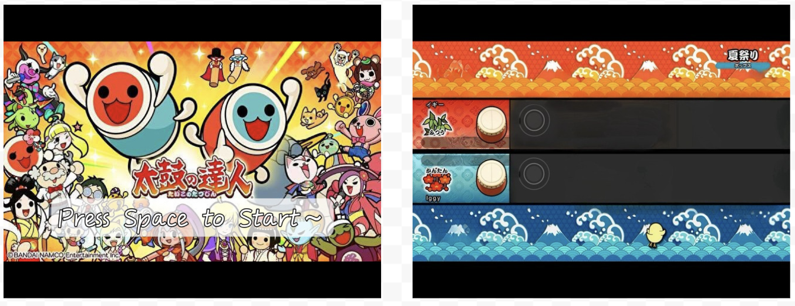

# Taiko_no_Tatsujin_FPGA

## Description
Designed and implemented a simplified two-player version of the rhythm game Taiko No Tatsujin on the FPGA as a System-on-chip(SOC). The main objective of our game is to press the specific key on the keyboard corresponding to notes scrolling from the right in the music. We mplemented using SystemVerilog as an Intellectual Property (IP) core to create a simplified text mode graphics controller. It also supports the MAX3421E chip as a USB transceiver, which serves as a USB host to connect to USB peripherals, like keyboards. Our design also uses PWM to play audio for the rhythm game
